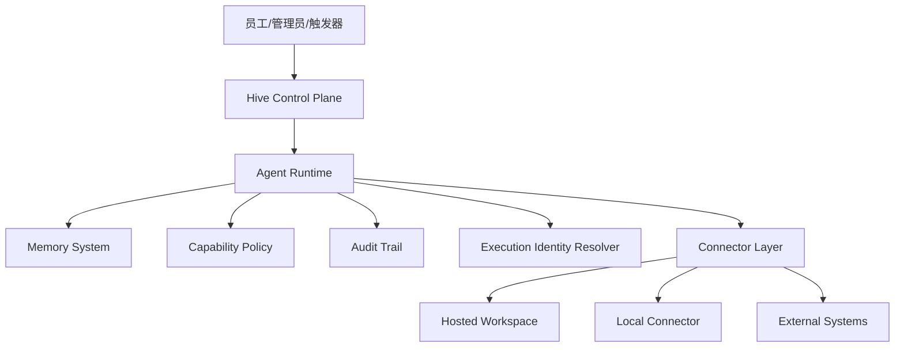

# Hive Agent-Native SaaS 执行与权限架构草案

> 基于当前代码状态整理
> 日期：2026-03-20
> 目标：为后续产品和工程决策提供一份可讨论、可拆解实施的结构化方案

---

## 1. 结论摘要

当前 Hive 的方向是对的：它已经不是单纯的聊天产品，而是在朝着“有身份、有记忆、有工作空间的 agent-native SaaS”演进。

但如果要真正走向企业可用和规模化，必须把下面三件事收敛成统一架构：

1. **Agent 在哪里干活**
   - 不能只停留在“云端容器”或“远程工作区”
   - 需要一个清晰的本地执行模型

2. **Agent 能干什么**
   - 不能只靠零散工具定义和审批等级
   - 需要统一 capability 模型

3. **Agent 用谁的身份去干**
   - 不能默认混淆“agent 自己”“员工本人”“企业服务账号”
   - 需要显式 execution identity

本文的核心建议是：

- **产品形态上**：坚持云端 control plane，不把完整 agent runtime 下放到用户机器
- **执行模型上**：引入轻量 `Local Connector`，让 agent 通过受控 capability 在本地目录上工作
- **权限模型上**：把 `访问权限`、`能力权限`、`外部身份` 三层明确拆开
- **集成模型上**：外部系统调用必须显式绑定 execution identity，不能继续维持模糊态

---

## 2. 当前代码所体现的真实状态

以下判断基于当前代码实现，而非抽象设想：

- Agent 基础模型位于 `backend/app/models/agent.py`
  - 已区分 `native` 与 `openclaw`
  - 已存在 `autonomy_policy`
  - 已存在 `AgentPermission`

- Agent 当前的“工作区”主要由 `backend/app/services/agent_manager.py` 维护
  - 核心抽象已经是 `agent workspace`
  - OpenClaw 模式通过挂载工作目录进入容器

- 远程 worker / gateway 模式已存在于 `backend/app/api/gateway.py`
  - 当前已经具备“控制面 + 远程执行端”的基础形态

- 访问权限控制主要在 `backend/app/core/permissions.py`
  - 当前偏重“谁能 use/manage agent”
  - 不是完整的运行时 capability policy

- 更细粒度的策略引擎已经出现在 `backend/app/core/policy.py`
  - 有成为统一资源权限系统的潜力
  - 但尚未成为 agent runtime 的主判定入口

- 飞书等渠道集成在 `backend/app/api/feishu.py`
  - 当前更像“agent 绑定 bot/app 凭证”
  - 不等价于“agent 代表某个员工执行”

这说明当前系统不是没有基础，而是**缺少一个统一的抽象层，把已有能力收口起来**。

---

## 3. 当前最核心的架构问题

### 3.1 本地执行语义不清楚

当前“本地工作”容易被误解成两种极端：

- 把 agent 完整装到员工电脑上
- 继续完全依赖云端 workspace

这两种都不是最优解。

真正需要的是：

- **云端继续负责编排、记忆、审计、权限决策**
- **本地只暴露最小能力面**

换句话说，应该把“agent 在本地干活”理解成：

> 云上的 agent 通过一个受控 connector，对本地授权目录和本地有限能力进行操作

而不是：

> 把完整 agent runtime 搬到本地机器

### 3.2 权限概念混在一起

当前至少有三类权限混合存在：

1. 谁能看到/使用/管理 agent
2. agent 自主执行某种动作需要什么审批
3. agent 在外部系统里到底拿着谁的身份执行

这三者目前没有统一模型，因此你会感觉“设置时权限边界不清楚”。

### 3.3 外部系统的身份映射不完整

以飞书为例，当前系统更接近：

- agent 配了一个飞书 bot 或应用
- agent 就能调用这部分能力

但企业真正关心的是：

- 这是 bot 自己发的，还是代表某个员工发的？
- 这是企业服务账号做的，还是员工个人授权做的？
- 审批是在什么身份下通过的？

如果这个问题不显式建模，权限体系永远会显得模糊。

---

## 4. 建议的总架构

建议把整个系统稳定成下面这套结构：

解释如下：

- `Control Plane`
  - SaaS 管理面
  - 负责租户、Agent 配置、审批策略、凭证管理、审计查看

- `Agent Runtime`
  - 负责推理循环、工具调用、记忆读写、事件流、审批前置判定

- `Capability Policy`
  - 负责判定 agent 是否允许执行某个动作

- `Execution Identity Resolver`
  - 负责决定某次动作到底是用哪种身份执行

- `Connector Layer`
  - 统一承接 hosted workspace、本地 connector、外部系统调用

---

## 5. 本地执行方案：推荐采用 Local Connector，而不是完整本地 Runtime

### 5.1 推荐的三层执行模式

建议未来支持三种执行模式：

#### Mode A: Hosted Workspace Agent

默认模式，也是当前最接近已有实现的模式。

特点：

- 工作空间在平台托管环境
- 适合标准文档、代码仓库、通用办公流程
- 权限边界最清晰

适用场景：

- SaaS 默认体验
- 团队共享知识工作流
- 不依赖本地软件或本地文件系统的任务

#### Mode B: Hosted Agent + Local Connector

这是最推荐的“本地工作”方案。

特点：

- Agent 仍然在云端编排
- 本地运行轻量 connector
- connector 只暴露有限 capability
- 本地仅挂载授权目录，不暴露整机控制权

适用场景：

- 处理员工本地文档
- 操作本地代码仓库
- 使用少量本地工具

#### Mode C: Full Local Runtime

不建议作为近期主路径，只保留为未来可能的高端形态。

特点：

- 完整执行链下放到本地
- 安全、升级、审计、运维都明显更复杂

适用场景：

- 严格内网
- 高合规隔离环境
- 明确要求离线或本地内推理的企业客户

### 5.2 为什么 Local Connector 是最轻的方式

因为它只解决“能力执行”问题，不把“决策编排”也搬到本地。

推荐 Local Connector 的最小能力面如下：

- `fs.read`
- `fs.write`
- `git.status`
- `git.diff`
- `proc.exec`
- `workspace.watch`

默认建议：

- `fs.read / fs.write / git.*` 可作为基础能力
- `proc.exec` 必须强审批或默认关闭

### 5.3 文档处理应该怎么做

对于 AI SaaS 而言，“文档”不应该被看作一条单独产品线，而应该是 workspace 的一种资源形态。

建议统一抽象为：

- file
- folder
- repository
- document connector
- knowledge collection

也就是说：

- 本地 Word / PDF / Markdown 文件
- 云端知识库文件
- 飞书文档 / 在线文档

都应该进入“workspace resource”统一抽象，而不是每种都单独发明一套 agent 语义。

---

## 6. 权限模型：必须拆成四层

这是本文最关键的建议。

### 6.1 Layer 1: Binding

描述“员工与 agent 的关系是什么”。

建议至少支持：

- `owner`
- `operator`
- `delegatee`
- `viewer`

说明：

- `owner` 负责创建与主要归属
- `operator` 可以日常操作 agent
- `delegatee` 表示 agent 可在一定边界内代表其工作
- `viewer` 只能观察和审计

为什么重要：

当前 `creator_id` 很重要，但不能长期兼任所有语义。

### 6.2 Layer 2: Access

描述“谁能对这个 agent 做什么操作”。

建议从现在的 `use/manage` 扩展为：

- `view`
- `invoke`
- `manage_config`
- `manage_permissions`
- `manage_credentials`
- `view_audit`

这一层是产品管理权限，不是工具执行权限。

### 6.3 Layer 3: Capability

描述“agent 允许执行哪些动作”。

建议将现在的 `autonomy_policy` 从“动作 -> L1/L2/L3”升级为真正的 capability policy。

每条 capability 至少包括：

- `action`
- `scope`
- `approval_level`
- `allowed_execution_identities`
- `conditions`

例如：

- `workspace.file.read`
- `workspace.file.write`
- `local.process.exec`
- `feishu.message.send`
- `feishu.calendar.create`
- `business.crm.customer.read`

### 6.4 Layer 4: Execution Identity

描述“某次动作最终是用谁的身份执行的”。

建议至少有三种：

- `agent_bot`
- `delegated_user`
- `tenant_service_account`

这层必须进入 runtime，而不是停留在配置层。

任何对外系统的调用，都必须能回答：

- 谁请求的
- 谁批准的
- 最终用什么身份执行

---

## 7. 飞书等外部系统的映射建议

建议把所有外部系统统一纳入同一种模型，而不是飞书单独做特判。

### 7.1 每个外部动作都必须绑定 execution identity

例如 `send_feishu_message`：

#### 模式 A：agent_bot

- 由 agent 绑定的 bot/app 执行
- 优点：稳定、容易审计
- 缺点：不是员工本人身份

#### 模式 B：delegated_user

- 员工通过 OAuth 或授权令牌授予 agent
- 优点：语义最准确
- 缺点：敏感度更高，需要更强撤销和审计机制

#### 模式 C：tenant_service_account

- 企业统一服务账号执行
- 适合系统通知、批处理操作
- 不适合拟人化地“替员工说话”

### 7.2 建议的默认规则

我建议默认规则如下：

- 默认优先使用 `agent_bot`
- 涉及“代表员工本人”的动作，必须要求 `delegated_user`
- 涉及系统级公共操作，可允许 `tenant_service_account`
- 禁止模糊态存在

例如：

- `send_notification_to_group`
  - 可允许 `agent_bot` 或 `tenant_service_account`

- `reply_to_employee_private_chat_as_employee`
  - 必须 `delegated_user`

- `create_employee_calendar_event`
  - 原则上应要求 `delegated_user`

这样权限审计和产品语义都会变得清晰。

---

## 8. 建议的数据模型方向

不要求一次性重构，但建议后续围绕这几个核心概念演进：

### 8.1 AgentBinding

描述人和 agent 的关系。

建议字段：

- `agent_id`
- `user_id`
- `binding_role`
- `status`
- `granted_by`
- `created_at`

### 8.2 CapabilityGrant

描述 agent 获得的能力边界。

建议字段：

- `agent_id`
- `capability_key`
- `scope`
- `approval_level`
- `allowed_execution_identities`
- `conditions`
- `granted_by`

### 8.3 CredentialBinding

描述外部系统凭证与 agent / 用户 / 租户之间的绑定关系。

建议字段：

- `provider`
- `credential_type`
- `owner_type`
- `owner_id`
- `scope_set`
- `revocable`
- `expires_at`

### 8.4 ExecutionRecord

描述一次具体动作是如何执行的。

建议字段：

- `trace_id`
- `agent_id`
- `requested_by_user_id`
- `approved_by_user_id`
- `capability_key`
- `execution_identity`
- `external_provider`
- `result`
- `timestamp`

---

## 9. 推荐的工程实施顺序

### Phase 1: 权限语义收口

目标：

- 明确 Binding / Access / Capability / Execution Identity 四层
- 不急着大改 UI
- 先把 runtime 能理解的权限语义固定下来

建议涉及模块：

- `backend/app/models/agent.py`
- `backend/app/core/permissions.py`
- `backend/app/core/policy.py`

### Phase 2: Tool Runtime 接入 Capability Policy

目标：

- 每个 tool call 都能映射到 capability
- 执行前先完成 capability 判定与审批等级判定
- 让当前 autonomy policy 成为 capability system 的兼容入口

建议涉及模块：

- `backend/app/services/agent_tools.py`
- `backend/app/runtime/*`

### Phase 3: 引入 Local Connector

目标：

- 不下放完整 runtime
- 只下放受控能力面
- 将“本地文件/本地仓库”纳入统一 workspace 体系

建议涉及模块：

- `backend/app/api/gateway.py`
- `backend/app/services/agent_manager.py`
- connector 注册与认证相关模块

### Phase 4: 接入外部系统的 Delegated Identity

目标：

- 飞书、日历、业务系统等统一执行身份
- 补齐凭证撤销、过期、审计

建议涉及模块：

- `backend/app/api/feishu.py`
- 渠道配置与凭证管理相关模型

---

## 10. 产品层面的建议

### 10.1 不要把“本地”做成默认主路径

默认产品形态仍应是：

- 云端 control plane
- 云端 runtime
- 云端托管 workspace

本地能力应是高级扩展项，而不是默认依赖。

原因很简单：

- 最轻
- 最容易审计
- 最容易多租户交付
- 最容易做权限边界

### 10.2 不要让 agent 默认继承员工全部权限

这是企业级产品最容易犯的大错。

正确方式是：

- 员工与 agent 建立绑定
- 员工或企业授予一部分能力
- agent 在受控 capability 与 execution identity 内执行

换句话说：

> agent 是一个独立的能力主体，而不是员工账号的影子

### 10.3 文档能力应成为 workspace 能力，而不是孤立功能

如果你们未来要做好文档场景，不要只做“文档问答”。

更合理的方向是：

- 把文档放入 workspace resource 抽象
- 把本地文档、云端文档、在线文档统一接入
- 让 agent 用统一工具面处理它们

这样你们的产品才真的会从聊天式 AI 工具进化成 agent-native AI SaaS。

---

## 11. 我建议当前先定死的两条产品原则

### 原则一

**Hive 的 agent 默认是云端编排实体，不是本地常驻代理。**

### 原则二

**任何外部动作都必须显式声明 execution identity。**

如果这两条不先定死，后面的权限设计很容易重新发散。

---

## 12. 待决策问题

后续正式落设计前，建议先就下面几件事做产品决策：

1. 默认的外部执行身份是否定为 `agent_bot`
2. 哪些动作必须强制 `delegated_user`
3. Local Connector 首期是否开放 `proc.exec`
4. 本地 connector 是单机单 agent，还是单机多 agent 共享
5. 文档资源是否统一先纳入 workspace，而不是单做 document center

---

## 13. 推荐的下一步产物

如果继续推进，建议后续产出两份文档：

1. **Capability & Execution Identity 详细设计**
   - 面向后端模型、runtime 判定、审批流、审计

2. **Local Connector 最小可用方案**
   - 面向本地目录挂载、认证、任务通道、能力协议

---

## 14. 参考的当前代码入口

- `backend/app/models/agent.py`
- `backend/app/services/agent_manager.py`
- `backend/app/api/gateway.py`
- `backend/app/core/permissions.py`
- `backend/app/core/policy.py`
- `backend/app/api/feishu.py`
- `backend/app/services/agent_tools.py`

---

## 15. 最后的判断

从产品方向上看，你现在关心的问题是对的，而且已经到了必须收口的阶段。

当前系统并不是没有能力，而是：

- 有 workspace
- 有 runtime
- 有权限雏形
- 有远程执行模式
- 有渠道集成

但还缺一个统一的系统设计，把这些拼成一个真正可解释、可治理、可扩展的 agent-native SaaS。

如果只继续加功能，不先把这一层抽象收住，后面 agent 越强，权限与本地执行问题只会越难修。
